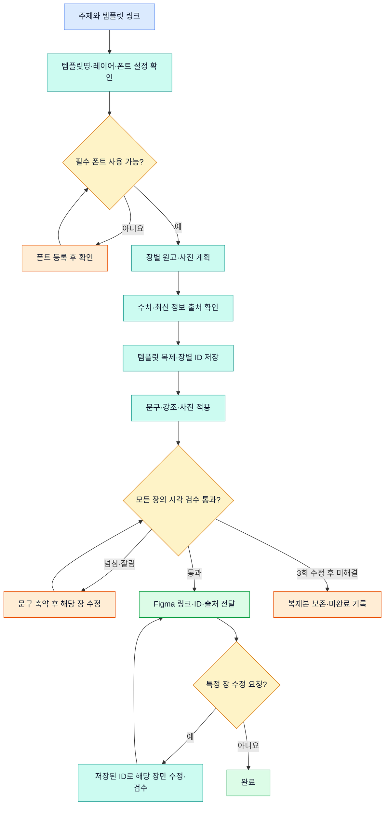

# Figma Carousel

자신의 Figma 템플릿을 복제해 주제별 한국어 캐러셀을 만드는 Codex 스킬입니다. 문구와 사진을 적용하고 장별 ID를 기록해 특정 장만 다시 수정합니다.

## 설치

```bash
git clone https://github.com/isaaskywalker/figma-carousel.git
cd figma-carousel
```

Codex에서 이 폴더를 열면 `.agents/skills/figma-carousel`을 프로젝트 스킬로 사용할 수 있습니다. 다른 프로젝트에 설치하려면 다음과 같이 요청하세요.

```text
$skill-installer로 https://github.com/isaaskywalker/figma-carousel/tree/main/.agents/skills/figma-carousel 를 설치해줘.
```

별도 Python 패키지나 OpenAI API 키 없이 Codex와 연결된 Figma 도구를 사용합니다. Figma 편집 권한과 Codex 이용 한도가 적용됩니다.

## 템플릿 설정

동일한 템플릿일 필요가 없습니다. [설정 예시](examples/carousel.config.example.json)를 `carousel.local.json`으로 복사하고 Codex에 Figma 링크와 페이지를 알려 실제 이름·ID를 채웁니다.

| 역할 | 예시 템플릿명 | 다른 이름 예시 |
| --- | --- | --- |
| 표지 | `[Template] Cover` | `표지`, `Cover A` |
| 본문 | `[Template] Context1` ~ `Context4` | `내용`, `정보 카드` |
| 마지막 장 | `[Template] End` | `마무리`, `CTA` |
| 사진 레이어 | `image` | `photo`, `배경 사진` |

이 이름들은 필수가 아닙니다. 본문 템플릿 하나를 여러 장으로 복제할 수 있습니다. 중복된 이름은 ID로 구분합니다. 제목·본문은 `layer_names`, 사진 레이어는 `image_layer_name`으로 지정합니다. 프레임 크기와 텍스트 폭은 자신의 템플릿을 따릅니다.

## 폰트와 분량 설정

기본값은 **템플릿의 기존 폰트와 크기 유지**입니다. `typography`의 `cover_title`, `body_title`, `body`에서 역할별로 설정합니다.

| 항목 | 의미 |
| --- | --- |
| `font_family`, `font_style` | 폰트 이름과 굵기. null이면 기존 값 유지 |
| `min_font_size` | 최소 크기. null이면 원래 크기를 하한으로 사용 |
| `max_lines` | 최대 줄 수 |
| `exact_lines` | true이면 정확히 해당 줄 수 |
| `emphasis_style` | 본문의 강조 굵기 |

예를 들어 표지 역할에 아래 값을 넣습니다. 다른 폰트와 크기도 지정할 수 있습니다.

```json
{"font_family":"Pretendard","font_style":"ExtraBold","min_font_size":95,"max_lines":2,"exact_lines":true}
```

지정하지 않은 계정명·배지 등은 원래 스타일을 유지합니다. 원격 환경에서 폰트가 없다면 Figma 계정 설정 → Your uploaded fonts에 등록 후 다시 확인합니다. 로컬 설치만으로는 부족할 수 있습니다. [Figma 폰트 안내](https://help.figma.com/hc/en-us/articles/360039956894-Add-a-font-to-Figma)

## 사용

```text
$figma-carousel로 취준생 포트폴리오 정리법 캐러셀 6장을 만들어줘.
carousel.local.json의 템플릿을 사용해줘.
```

```text
$figma-carousel로 runs/에 기록된 마지막 결과의 3장 본문만 더 쉽게 써줘.
```

## 워크플로우



## 기본 제작 규칙

- 훅 표지 → 문제 제기 → 핵심 정보 2장 → 실천 방법 → 행동 유도.
- 표지 제목 정확히 2줄, 본문 제목 최대 1줄, 본문 최대 5줄. 설정으로 변경 가능합니다.
- 2030 여성 취준생·직장인 대상의 친근하고 전문적인 존댓말.
- 넘치면 먼저 문구를 줄이고 최소 크기와 텍스트 상자 높이를 지킵니다.
- 원본을 유지하고 복제본에만 문구와 관련 사진을 적용합니다.
- 장별 ID와 검수 결과는 `runs/<run-id>/manifest.json`, 내용·사진 출처는 `sources.json`에 기록합니다.

## 검증 범위

2026-10-06 실제 템플릿으로 취준생 포트폴리오 정리법 6장을 제작했습니다. Pretendard 및 Pretendard Variable 로딩, 복제, 6장 사진 적용과 전체 시각 검수를 확인했습니다. 실험본은 표지 95px·본문 제목 57px·본문 35px, 본문 폭 861px·4줄이었습니다. 이는 검증 사례이며 다른 템플릿에 강제하지 않습니다. 다른 템플릿·폰트는 실행 시 다시 점검합니다.

Codex가 요청받아 실행하는 스킬이며 Figma 내부 플러그인, GitHub Actions 자동 편집, 예약 실행·SNS 게시는 포함하지 않습니다. 폰트나 사진 적용 실패는 미완료로 기록합니다. 원본 Figma 파일, 개인 ID·설정·실행 기록, 폰트·사진 파일은 배포하지 않으며 해당 자료의 재배포 권한을 부여하지 않습니다.
