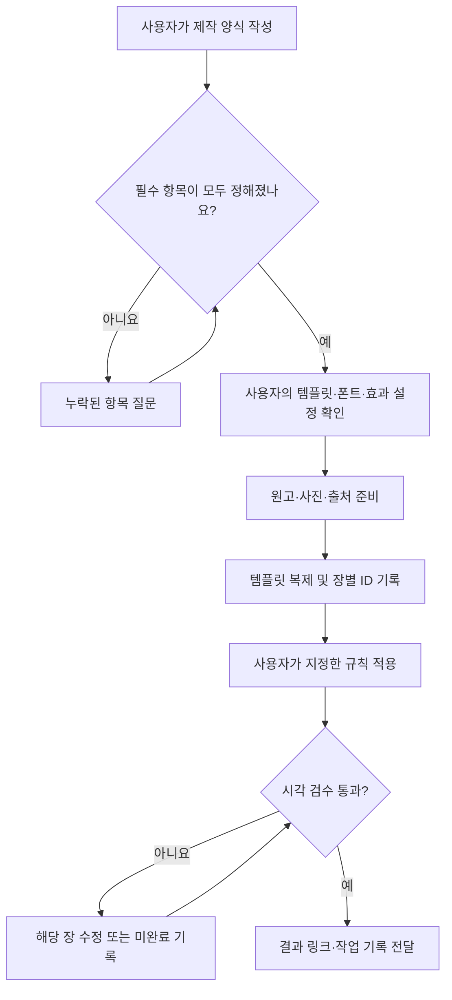

# Figma Carousel

사용자가 작성한 제작 양식과 자신의 Figma 템플릿으로 캐러셀을 만드는 Codex 스킬입니다. 원본을 복제해 문구와 사진을 적용하고, 장별 ID로 부분 수정을 지원합니다.

## 설치

```bash
git clone https://github.com/isaaskywalker/figma-carousel.git
cd figma-carousel
```

Codex에서 이 폴더를 열거나 아래처럼 스킬 설치를 요청하세요.

```text
$skill-installer로 https://github.com/isaaskywalker/figma-carousel/tree/main/.agents/skills/figma-carousel 를 설치해줘.
```

Codex와 Figma 연결 및 대상 파일의 편집 권한이 필요합니다.

## 시작 전 필수: 제작 양식 작성

**제작을 시작하기 전에 [제작 양식](.agents/skills/figma-carousel/references/intake-form.md)을 작성해 주세요.** 양식을 `carousel-brief.local.md`로 복사해 작성하거나, 항목별 답변을 Codex 대화에 입력합니다. 미작성 항목은 스킬이 확인하며, 필수 입력이 완료되기 전에는 원고 생성·템플릿 복제·편집을 시작하지 않습니다.

양식에는 주제, 독자, 문체, 장수와 구성, 템플릿 위치·이름, 폰트·크기·줄 수, 레이아웃, 효과 처리, 사진 및 출처 기준을 직접 지정합니다. 효과는 유지·제거·직접 지정 중 선택합니다. 값이 없는 경우 이전 사용자의 설정으로 채우지 않습니다.

‘내 템플릿 값 사용’을 명시적으로 선택할 수도 있습니다. 해당 값은 그 사용자의 작업에만 적용하며 저장소에 올리지 않습니다.

## 템플릿과 설정

[빈 설정 파일](examples/carousel.config.example.json)은 작성된 양식을 구조화해 저장하는 선택적 보조 파일입니다. `carousel.local.json`으로 복사해 사용하며, 양식을 대신하지 않습니다.

| 역할 | 사용자가 입력하는 내용 |
| --- | --- |
| 표지 | 사용할 프레임 이름 또는 ID |
| 본문 | 사용할 프레임 이름 또는 ID 목록 |
| 마무리 | 사용할 프레임 이름 또는 ID, 또는 사용 안 함 |
| 사진 | 사진 레이어 이름, 또는 사진 사용 안 함 |

어떤 템플릿명도 강제하지 않습니다. 본문 템플릿 하나를 반복 복제할 수 있습니다. 폰트, 크기, 줄 수, 그림자·그라데이션·블러 등 효과의 기본 수치는 제공하지 않습니다. 원격 Figma에서 선택한 폰트를 사용할 수 있는지 실행 전에 확인합니다.

## 사용

```text
$figma-carousel를 시작할게. 먼저 작성해야 할 제작 양식을 보여줘.
```

```text
작성한 carousel-brief.local.md를 확인하고, 누락된 필수 항목이 없으면 제작해줘.
```

부분 수정도 저장된 제작 양식과 장별 ID를 확인한 뒤 요청한 범위에만 적용합니다.

## 워크플로우



## 자료 관리

완성된 양식, 실제 설정, 원본 템플릿, 폰트·사진 파일과 실행 기록은 공개 저장소에 커밋하지 않습니다. 작업 기록은 로컬 `runs/`에 보관합니다. 출처가 필요한 내용과 사진의 출처도 해당 작업에만 기록합니다.

이 저장소는 제작 절차를 제공하는 스킬입니다. Figma 내부 플러그인이나 자동 게시 서비스는 포함하지 않습니다.
